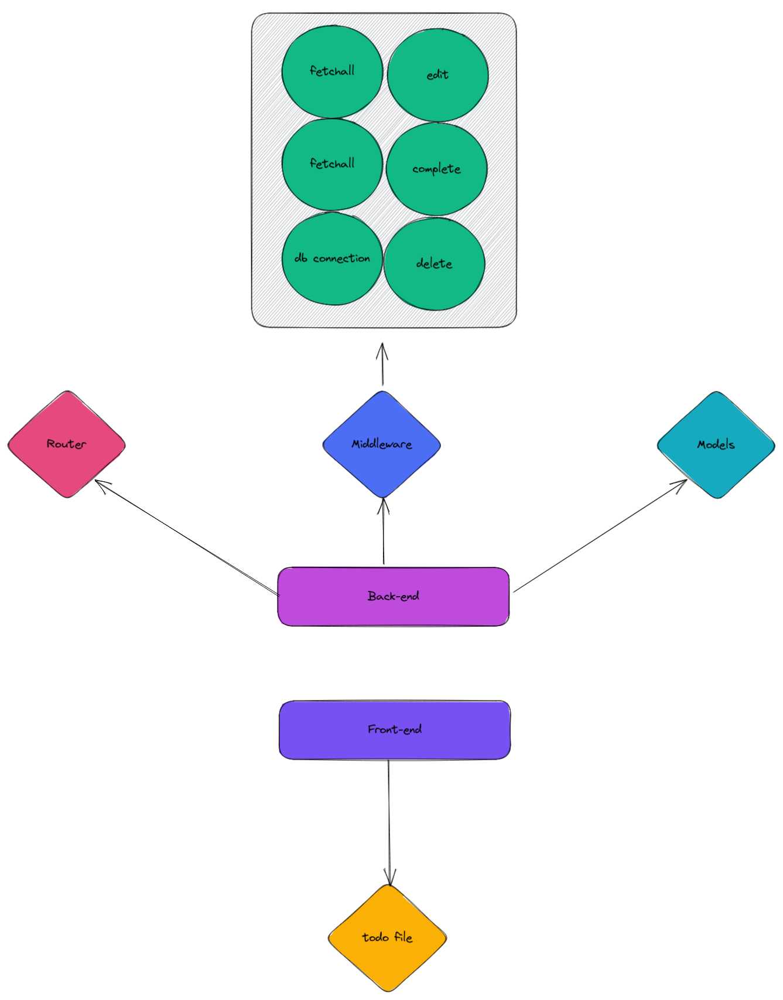

# Todoapp

## Introduction

This project is a simple side-project. Its goal is to develop the basic skills in both back-end and front-end.

## Architecture



## Technologies used

**Front-end**: React<br/>
**Back-end**: Golang<br/>
**Database**: Mongodb<br/>
**Deployment** : Docker<br/>
## Getting Started

### Installation

Install the following packages:
- [Docker](https://docs.docker.com/engine/install/)
- [Docker Compose](https://docs.docker.com/compose/install/)

### Quickstart

```
# First, create a file '.env' from the given example in the back-end folder
cp .env-example .env

# Then, update it

# Finally, run the following command at the root:
docker-compose up
```

### Usage

- The web application runs on on [http://localhost:3000](http://localhost:3000)
- The back-end runs on [http://localhost:9000](http://localhost:9000). 

## Get involved

If you're interested in how the project is organized at a higher level, please contact the maintainers.

## Maintainers :heart:

[<br><sub>Abdelkarim BENGRINE</sub>](https://github.com/AbdelkarimBENGRINE)